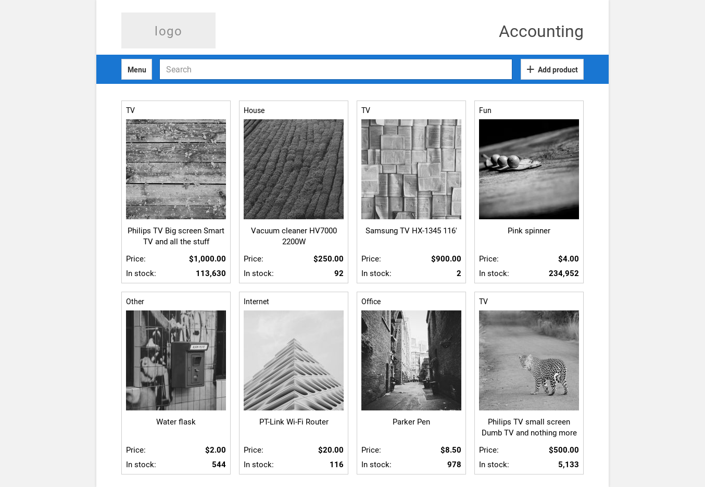

# Shop accounting
This is the test task



>*The images presented as product images are just demonstration of completed UI/UX (and also of async loaded data)*

## Used stack
- React.js / Redux
- Redux-form
- Sass + PostCSS
## Installation process
```
git clone https://github.com/artyeug/shop-accounting.git
cd shop-accounting
npm install
npm start
```
## Credits

SVG icons from [Material Design](https://www.flaticon.com/packs/material-design/)
(made by Google from www.flaticon.com)

Randomly generated images from [Lorem Picsum](https://picsum.photos)
(seed: https://picsum.photos/g/192/?random)
